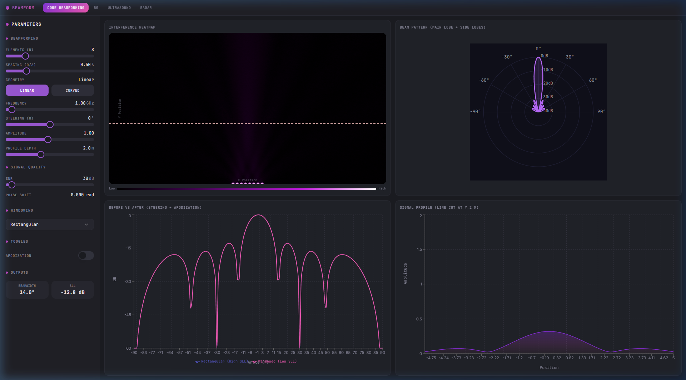
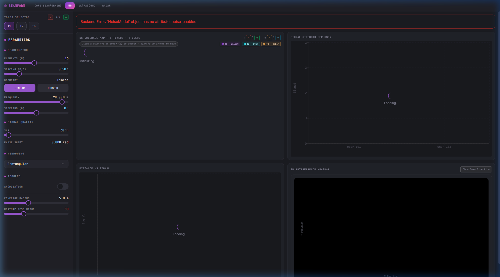
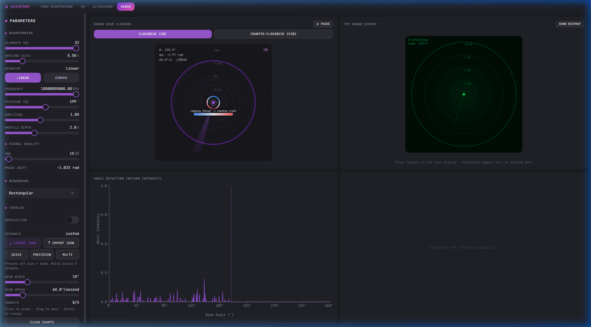
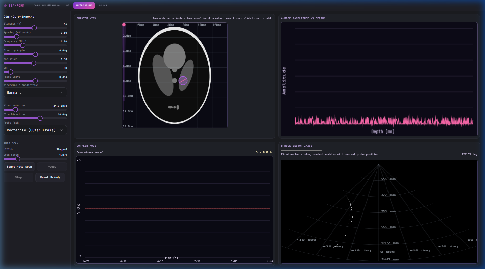

<div align="center">

# 🌊 Beamforming Simulator

### *See the physics. Steer the wave. Understand the invisible.*

[](https://react.dev/)
[](https://www.typescriptlang.org/)
[](https://fastapi.tiangolo.com/)
[](https://www.python.org/)

**A full-stack interactive beamforming simulation platform** covering **5G massive MIMO**, **radar signal processing**, and **medical ultrasound imaging** — all powered by rigorous physics computations and a real-time React frontend.

</div>

---

## 📸 Screenshots

### 🏠 Core Beamforming — Interference & Polar Beam Patterns

> Visualize how antenna array parameters sculpt electromagnetic fields in real time. Adjust element count, spacing, steering angle, and apodization window to watch the beam pattern morph instantly.



| Panel | Description |
|---|---|
| 🔴 **Interference Heatmap** | 2D heat map of the array's near-field radiation pattern |
| 📡 **Polar Beam Pattern** | Main lobe + side lobes in a radar-style polar plot |
| 📊 **Before vs After** | Side-lobe level comparison with/without apodization |
| 📈 **Signal Profile** | Amplitude line cut at a configurable depth |

---

### 📶 5G Massive MIMO Simulator — Multi-User Beam Tracking

> Simulate a city block with 3 base-station towers and 2 mobile users. Towers dynamically split their antenna sub-arrays to serve multiple users simultaneously, with independent per-user color-coded beams.



- Click a **tower** or **user** on the map to select it
- Use **W/A/S/D** or **arrow keys** to move the selected user in real time
- Watch **signal strength bars** and the **2D interference heatmap** respond live

---

### 🎯 Radar Beamforming Simulator — Target Detection & Tracking

> A full pulse-radar simulation: rotating beam sweep, target placement, Doppler-based velocity estimation, and a PPI scope display.



- **Click** anywhere on the sweep display to place a target
- **Drag** to reposition; **scroll** to resize radar cross-section (RCS)
- Switch between **CW** and **CCW** scan directions
- Use **Quick / Precision / Multi** presets; Export/Import scenarios as **JSON**

---

### 🩺 Ultrasound Beamforming Simulator — Medical Imaging

> Simulate phased-array ultrasound from probe placement to B-mode image reconstruction. Includes a Shepp-Logan-style phantom with editable tissue layers, real-time A-mode echoes, and Doppler flow analysis.



- **Drag the probe** (pink dot) around the phantom perimeter to steer the scan direction
- **Drag vessels/tissues** inside the phantom to reposition them
- **Click** a tissue to open its property editor
- Toggle **Auto Scan** to animate a full sweep and build the B-mode image

---

## 🚀 Quick Start

### Prerequisites

| Tool | Minimum Version |
|---|---|
| Node.js | 18+ |
| Python | 3.8+ |
| npm | 8+ |

### Install

```bash
# Backend
cd backend && pip install -r requirements.txt

# Frontend
cd frontend && npm install
```

### Run (Development)

```bash
# Terminal 1 — FastAPI Backend (port 5000)
cd backend && python run_server.py

# Terminal 2 — Vite Dev Server (port 8080)
cd frontend && npm run dev
```

Open **http://localhost:8080** 🎉

---

## 🎯 Simulators

### 🏠 Core Beamforming (`/`)

<details>
<summary><strong>Controls & Parameters</strong></summary>

| Parameter | Range | Effect |
|---|---|---|
| Elements (N) | 4 – 64 | Narrows the main lobe; raises directivity |
| Spacing (d/λ) | 0.25 – 1.5 | Controls grating lobe onset |
| Frequency | 0.1 – 100 GHz | Scales wavelength |
| Steering angle (θ) | −90° – +90° | Electronically tilts the beam |
| SNR | 0 – 60 dB | Adds physics-accurate Gaussian noise |
| Window function | Rectangular, Hamming, Hanning, Blackman, Kaiser | Trades side-lobe level for main-lobe width |
| Apodization | On / Off | Applies window weights to array elements |

</details>

<details>
<summary><strong>Output Panels</strong></summary>

- **Interference Heatmap** — 2D near-field radiation pattern
- **Polar Beam Pattern** — Main lobe and side lobes, dB scale
- **Before vs After** — Rectangular-window vs windowed overlay
- **Signal Profile** — 1D line cut at the configured depth
- **Beamwidth & SLL readouts** — Live 3 dB beam width and side-lobe level

</details>

---

### 📶 5G Massive MIMO (`/5g`)

<details>
<summary><strong>Controls & Parameters</strong></summary>

| Parameter | Description |
|---|---|
| Tower selector (T1/T2/T3) | Select which tower's parameters to edit |
| Elements (N) | Array size per tower (split per user for multi-user MIMO) |
| Frequency | Operating frequency (28 GHz mmWave default) |
| Coverage radius | Per-tower service area in meters |
| Heatmap resolution | Grid cells in the interference heatmap |

</details>

<details>
<summary><strong>Output Panels</strong></summary>

- **5G Coverage Map** — Interactive canvas with draggable towers & keyboard-movable users
- **Signal Strength per User** — Bar chart of received signal power
- **Distance vs Signal** — Path-loss curve per user
- **2D Interference Heatmap** — Field intensity across the coverage area

</details>

---

### 🎯 Radar Simulator (`/radar`)

<details>
<summary><strong>Controls & Parameters</strong></summary>

| Parameter | Range | Description |
|---|---|---|
| Elements (N) | 4 – 64 | Array size → beam narrowing |
| Beam width | 3° – 30° | Manual beam width override |
| Scan speed | 10° – 360°/s | Antenna rotation rate |
| SNR | 0 – 60 dB | Noise floor (backend-computed) |
| Scan direction | CW / CCW | Clockwise or counter-clockwise sweep |

</details>

<details>
<summary><strong>Output Panels</strong></summary>

- **Radar Sweep** — Animated rotating beam with range rings and target blips
- **PPI Radar Screen** — Classic plan-position indicator (green phosphor)
- **Angle Detection Chart** — Normalized return intensity across all azimuth angles

</details>

---

### 🩺 Ultrasound Simulator (`/ultrasound`)

<details>
<summary><strong>Controls & Parameters</strong></summary>

| Parameter | Range | Description |
|---|---|---|
| Elements (N) | 8 – 128 | Transducer element count |
| Frequency | 2 – 12 MHz | Penetration vs resolution trade-off |
| Steering angle | −45° – +45° | Off-axis beam steering |
| SNR | 10 – 80 dB | Tissue noise model |
| Blood velocity | −100 – +100 cm/s | Doppler flow speed |
| Flow direction | 0 – 360° | Angle of blood flow relative to beam |
| Probe path | Rectangle, Arc, Linear, Radial | Auto-scan trajectory |

</details>

<details>
<summary><strong>Output Panels</strong></summary>

- **Phantom View** — Anatomical cross-section with draggable organs, vessels, and probe
- **A-Mode** — Echo amplitude vs depth
- **Doppler Mode** — Time-domain Doppler waveform with `fd` shift readout
- **B-Mode Sector Image** — 2D ultrasound image built scan-line by scan-line

</details>

---

## 🏗️ Architecture

```
┌──────────────────────────────────────────────────────────────┐
│                 React + TypeScript Frontend                   │
│  Pages · Components · Custom Hooks · Canvas + Recharts       │
│                   Vite dev server · Port 8080                 │
└─────────────────────────────┬────────────────────────────────┘
                              │  HTTP REST API (JSON)
                              ▼
┌──────────────────────────────────────────────────────────────┐
│                   FastAPI Backend · Port 5000                 │
│  api/routes.py  →  POST /api/simulate/{5g,radar,ultrasound}  │
│  service.py     →  Orchestration & business logic            │
│  simulators/    →  Physics engines (NumPy)                   │
│  core/          →  Array factor · Noise model · Windows      │
└──────────────────────────────────────────────────────────────┘
```

---

## 📡 API Endpoints

Base URL: `http://localhost:5000/api`

| Method | Endpoint | Description |
|---|---|---|
| `GET` | `/health` | Server health check |
| `POST` | `/simulate/5g` | Run 5G MIMO simulation |
| `POST` | `/simulate/radar` | Run radar simulation |
| `POST` | `/simulate/ultrasound` | Run ultrasound simulation |

---

## 📦 Tech Stack

| Layer | Libraries |
|---|---|
| **Frontend** | React 18, TypeScript, Vite, Recharts, Canvas API, Framer Motion, ShadCN/UI, Tailwind CSS |
| **Backend** | FastAPI, Uvicorn, NumPy, Pydantic, Python 3.8+ |

---

## 🐛 Troubleshooting

| Problem | Fix |
|---|---|
| Frontend can't reach backend | `cd backend && python run_server.py` |
| `CORS error` in browser | Verify backend is on port 5000 |
| `ModuleNotFoundError` | `pip install -r backend/requirements.txt` |
| Blank charts on first load | Refresh the page after ~2 s (API cold start) |
| `npm install` fails | Ensure Node ≥ 18 (`node -v`) |

---

<div align="center">

**Built with ❤️ — physics-accurate, real-time, and open source.**

*May 2026 · v2.0.0*

</div>
